# Blackhole Blockchain - Project Workflow Documentation

## 🌊 Complete System Workflow

### 🚀 System Startup Sequence

#### 1. Blockchain Node Initialization
```bash
cd core/relay-chain/cmd/relay
go run main.go 3000
```

**Startup Process**:
1. **Genesis Block Creation**: Initialize blockchain with system tokens
2. **P2P Node Setup**: Create libp2p host on port 3000
3. **Database Initialization**: Open LevelDB for blockchain storage
4. **Stake Ledger Setup**: Initialize with genesis validator
5. **Token Registry**: Create native BHX token
6. **API Server Start**: Launch HTTP server on port 8080
7. **Mining Loop**: Begin block production every 6 seconds
8. **Peer Discovery**: Display multiaddr for wallet connections

**Output Example**:
```
🚀 Your peer multiaddr:
   /ip4/127.0.0.1/tcp/3000/p2p/12D3KooWEHMeACYKmddCU7yvY7FSN78CnhC3bENFmkCcouwu1z8R
🌐 API Server starting on port 8080
🌐 Open http://localhost:8080 in your browser
```

#### 2. Wallet Service Initialization
```bash
cd services/wallet
go run main.go -peerAddr /ip4/127.0.0.1/tcp/3000/p2p/12D3KooW...
```

**Startup Process**:
1. **Command-line Parsing**: Parse peer address flag
2. **MongoDB Connection**: Connect to wallet database
3. **P2P Client Setup**: Create blockchain client on port 5000+
4. **Blockchain Connection**: Connect to blockchain node via P2P
5. **CLI Interface**: Start interactive wallet interface

## 🔄 Core Operational Workflows

### 1. 👤 User Registration & Wallet Creation

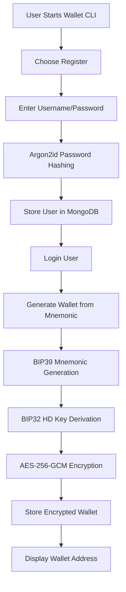

**Detailed Steps**:
1. **User Registration**: Secure password hashing with Argon2id
2. **Wallet Generation**: BIP39 mnemonic → BIP32 HD keys → Address
3. **Encryption**: Private keys encrypted with user password
4. **Storage**: Encrypted wallet data stored in MongoDB

### 2. 💰 Token Transfer Workflow

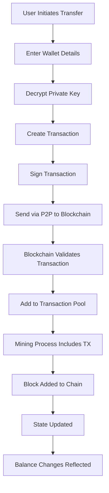

**Transaction Lifecycle**:
1. **Creation**: User creates transaction with recipient and amount
2. **Validation**: Wallet validates balance and transaction format
3. **Signing**: Transaction signed with private key (simplified)
4. **Broadcasting**: Sent to blockchain node via P2P
5. **Pool Addition**: Added to pending transaction pool
6. **Mining**: Included in next mined block
7. **Execution**: Applied to blockchain state
8. **Confirmation**: Balance updates reflected

### 3. 🏛️ Staking Workflow

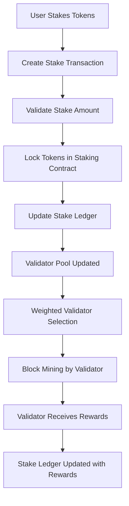

**Staking Process**:
1. **Token Locking**: Tokens moved to staking_contract address
2. **Stake Recording**: Amount recorded in stake ledger
3. **Validator Eligibility**: Address becomes eligible for validation
4. **Selection Algorithm**: Stake-weighted random selection
5. **Block Rewards**: Validators earn BHX tokens for mining blocks

### 4. ⛏️ Mining & Consensus Workflow

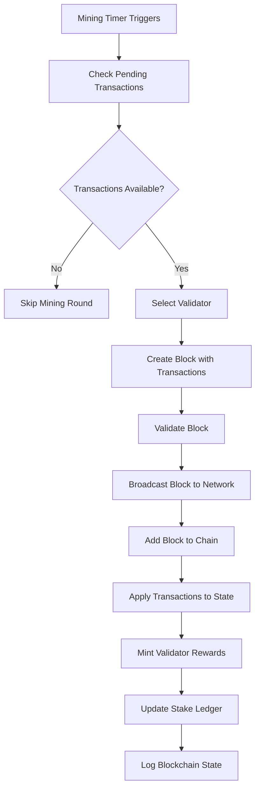

**Mining Details**:
- **Frequency**: Every 6 seconds (configurable)
- **Validator Selection**: Stake-weighted random selection
- **Block Rewards**: 10 BHX per block
- **Transaction Processing**: All pending transactions included

### 5. 💱 DEX Trading Workflow

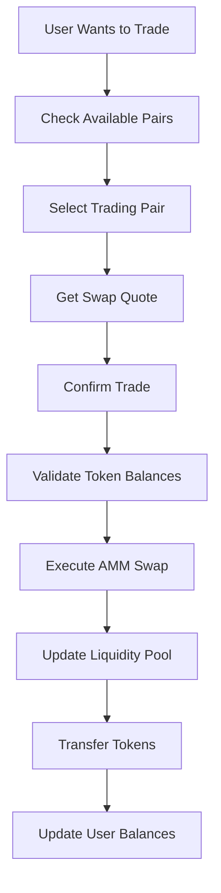

**DEX Features**:
- **AMM Model**: Constant product formula (x * y = k)
- **Liquidity Pools**: User-provided liquidity
- **Slippage Protection**: Price impact calculation
- **Multiple Pairs**: Support for any token pair

### 6. 🔒 Escrow Workflow

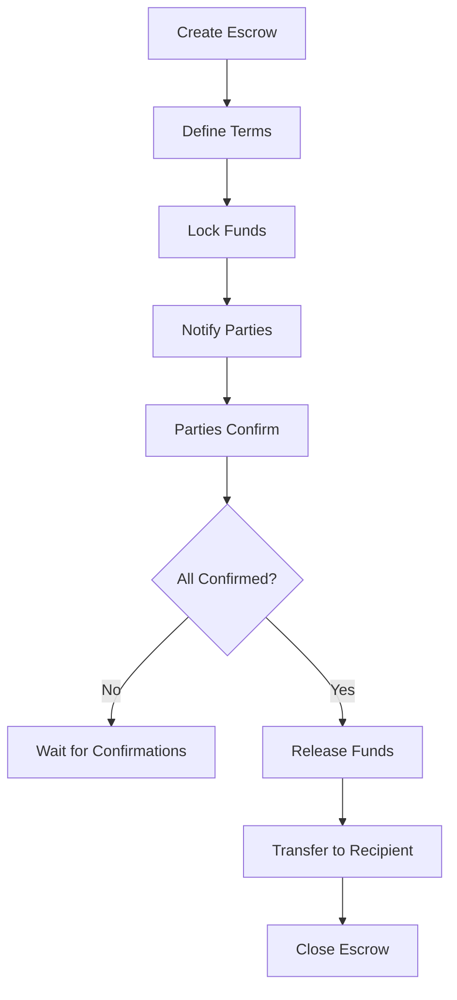

**Escrow States**:
- **Created**: Initial escrow setup
- **Confirmed**: All parties agreed
- **Released**: Funds transferred
- **Cancelled**: Escrow terminated

### 7. 🔐 Multi-Signature Workflow

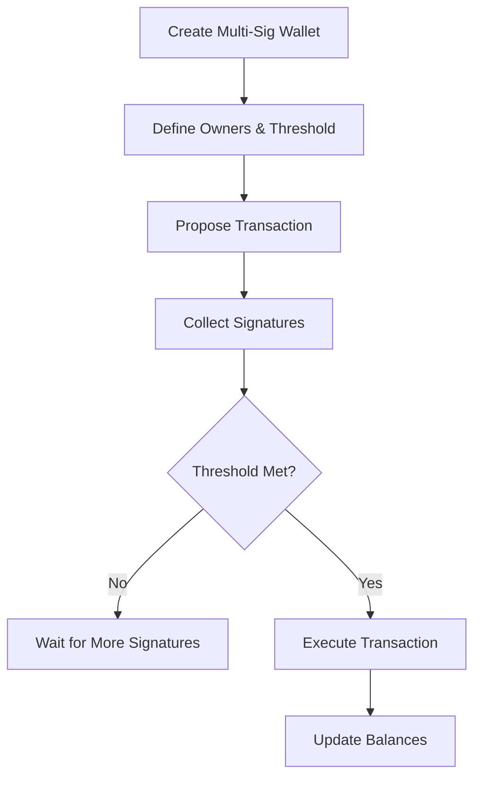

**Multi-Sig Features**:
- **N-of-M Signatures**: Configurable signature requirements
- **Transaction Proposals**: Time-limited proposals
- **Automatic Execution**: When threshold reached

## 🌐 P2P Network Workflow

### Peer Discovery & Connection
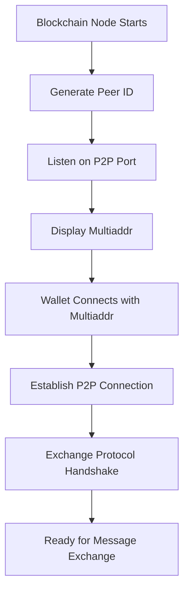

### Message Broadcasting
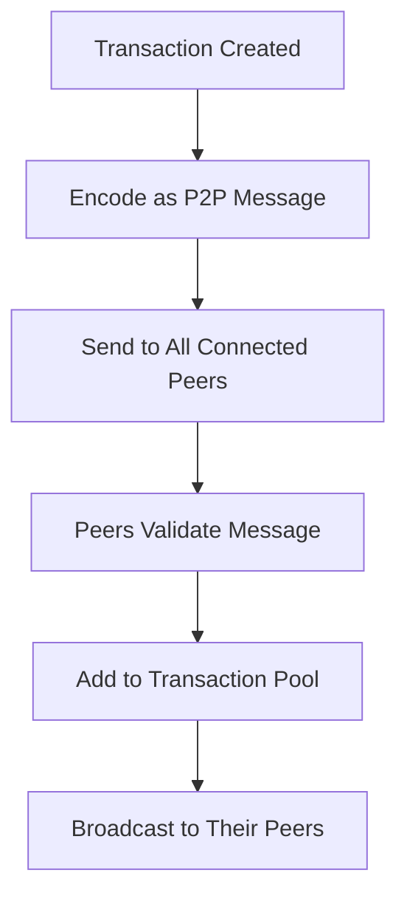

## 📊 Data Flow Architecture

### 1. Wallet → Blockchain Flow
```
User Input → Wallet CLI → MongoDB (user data) → P2P Client → Blockchain Node → LevelDB (blockchain data)
```

### 2. Blockchain → Dashboard Flow
```
Blockchain State → API Server → HTTP Response → HTML Dashboard → Real-time Updates
```

### 3. Mining Flow
```
Transaction Pool → Validator Selection → Block Creation → State Application → Database Storage → P2P Broadcasting
```

## 🔄 State Management

### Blockchain State
- **Blocks**: Immutable block history
- **Transactions**: All transaction records
- **Balances**: Token balances per address
- **Stakes**: Validator stake amounts
- **Pools**: DEX liquidity pools

### Wallet State
- **Users**: Encrypted user accounts
- **Wallets**: Encrypted wallet data
- **History**: Transaction history records

## 🚨 Error Handling Workflows

### Connection Failures
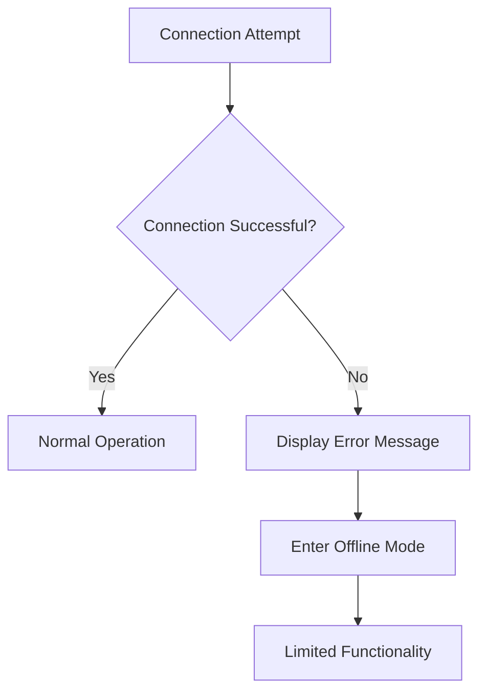

### Transaction Failures
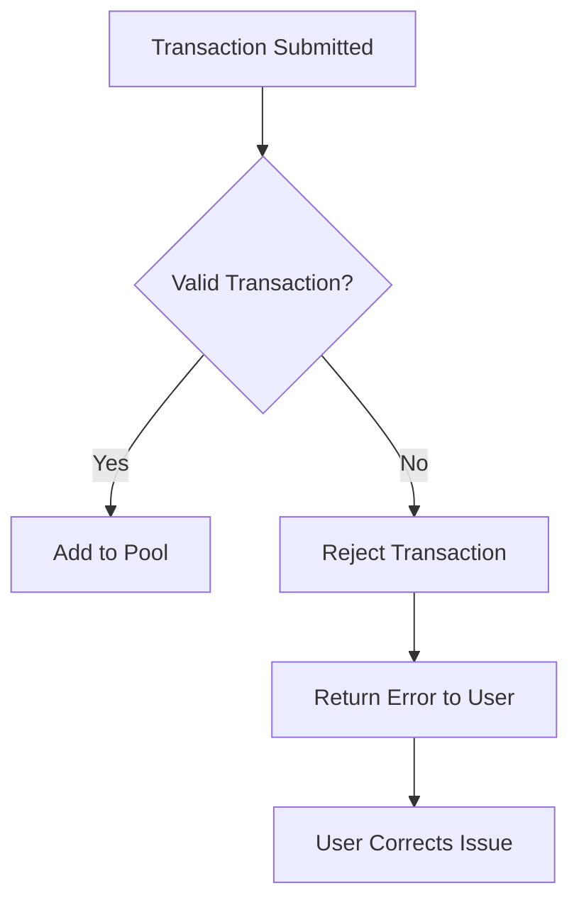

### Consensus Failures
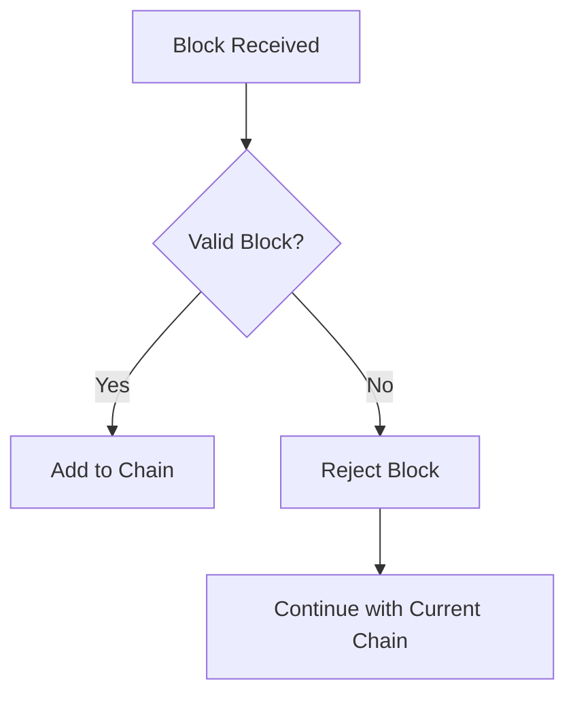

## 🔧 Configuration Workflows

### Environment Setup
1. **MongoDB**: Start database service
2. **Go Dependencies**: Install required modules
3. **Network Ports**: Ensure ports 3000, 8080 available
4. **File Permissions**: Ensure database write access

### Multi-Node Setup
1. **Start First Node**: `go run main.go 3000`
2. **Copy Peer Address**: From first node output
3. **Start Second Node**: `go run main.go 3001 <peer_address>`
4. **Verify Connection**: Check P2P connection logs

This workflow documentation provides a comprehensive understanding of how all components interact to create a complete blockchain ecosystem.
